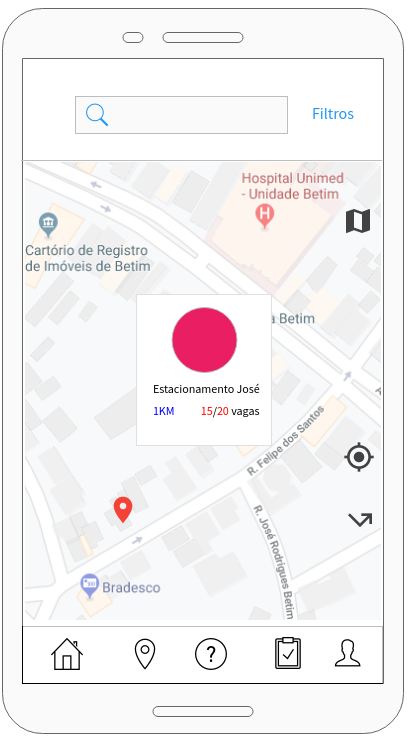

# App-de-estacionamento

Interfaces feitas para um possivel app de estacionamento de um trabalho da faculdade

<h1>Tela de login</h1>

<h1>Home</h1>

<h1>Ajuda</h1>

<h1>Mapa</h1>

<h1>Compras</h1>

